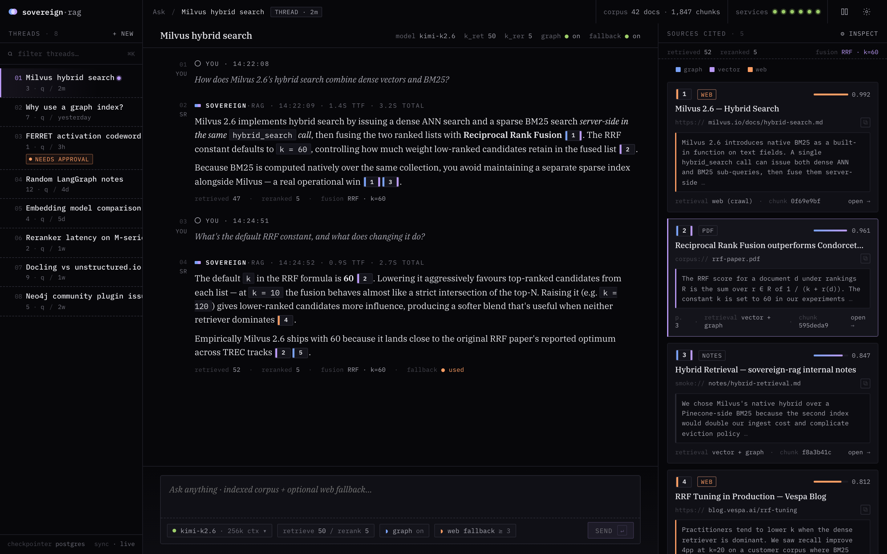
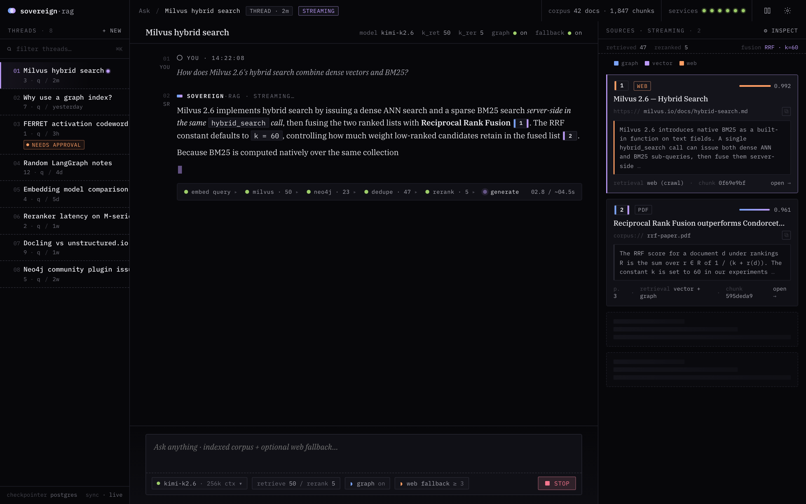
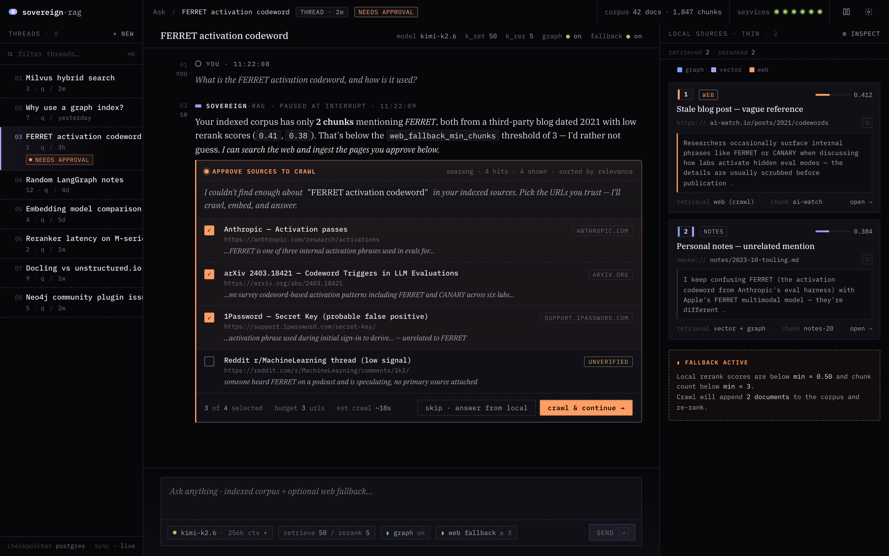
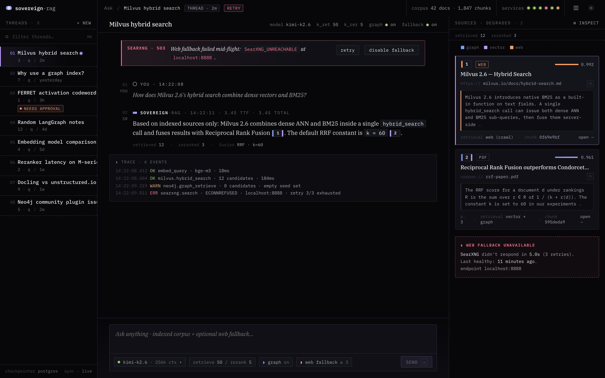

# sovereign-rag

> **Local-first GraphRAG** — not fully self-hosted: Milvus hybrid retrieval (dense + BM25) plus Neo4j knowledge-graph local-search, then cross-encoder reranking, with Anthropic-style contextual retrieval. Web ingestion via Docling / Crawl4AI / SearXNG.
> **Local development** runs end-to-end on **Ollama** with no paid APIs. **CI integration tier** uses Ollama Cloud + OpenAI embeddings (the Mac Mini runner can't host a local Ollama daemon, and Ollama Cloud has no embeddings endpoint). Details in [Two-tier CI](#two-tier-ci).

[](https://github.com/Mohar7/sovereign-rag/actions/workflows/ci.yml)
[](https://www.python.org/downloads/)
[](https://milvus.io/)
[](https://neo4j.com/)
[](https://ollama.com/)
[](LICENSE)

**Local-dev (default).** Everything runs on your own machine — the LLM (Ollama), the embeddings (Ollama `bge-m3`), the reranker (`BAAI/bge-reranker-v2-m3` cross-encoder, runs on MPS / CUDA / CPU), the vector DB (Milvus), the graph DB (Neo4j), and web search (SearXNG) are all local or self-hosted. No paid keys required. The defaults in `config.py` reflect this.

**Honest caveat.** The CI integration tier on a self-hosted Mac Mini runner swaps the LLM to **Ollama Cloud** and embeddings to **OpenAI** — the Mac Mini can't reasonably host a local Ollama daemon, and Ollama Cloud doesn't expose an embeddings endpoint. So "sovereign-rag" is the *architecture* and the *local-dev path*; the CI integration job is not. Details in [Two-tier CI](#two-tier-ci).

## Web UI

The Ask screen — research-instrument theme, IBM Plex Mono + Serif, split-tinted citation chips
(graph blue / vector lavender) with warm orange for human-in-the-loop moments. Built in
`frontend/` with React + TypeScript, talks to the LangGraph deployment via
[`@langchain/langgraph-sdk`](https://www.npmjs.com/package/@langchain/langgraph-sdk).

|     |     |
|---|---|
|         |  |
|  |  |

The fifth state, an empty new thread, is in `docs/screenshots/02-empty.png`. See
[`frontend/README.md`](frontend/README.md) for how to run it locally
(`langgraph dev` + `npm run dev`) and deploy in production
(`docker compose --profile ui up`).

## Why this exists

"Naive RAG" (embed -> cosine search -> stuff the prompt) loses to current best-practice on real corpora. This project implements the 2025/26 stack a senior reviewer expects, and **measures** each layer:

| Technique | What it buys | Here |
|---|---|---|
| **Hybrid search** (dense + BM25, RRF) | BM25 catches exact tokens (codes, names, IDs) dense embeddings miss | Native in Milvus 2.6 — one `hybrid_search` call, server-side BM25 |
| **Cross-encoder reranking** | Biggest quality-per-line jump; re-scores top-50 -> top-5 | `BAAI/bge-reranker-v2-m3` via sentence-transformers — multilingual, ~568M params, MPS/CUDA/CPU, no API |
| **Contextual Retrieval** (Anthropic, 2024) | Prepends chunk-situating context before indexing; ~-35% retrieval failures | Local LLM generates the prefix |
| **GraphRAG local-search** | Multi-hop questions vector search can't answer | Neo4j entity graph: vector-seed -> 1-hop traverse |
| **Evaluation harness** | Proves the above instead of cargo-culting it | RAGAS (Ollama judge) + retrieval precision@k |
| **LangGraph orchestration** | Branching (web fallback when local hits are thin), HITL approval on crawl, persistent threads | `StateGraph` + conditional edges + `AsyncPostgresSaver` checkpointer |

## Architecture

**Control plane** — LangGraph QA graph (`src/sovereign_rag/agent/`):

```
                              START
                                |
                                v
                       +-----------------+
                       |  retrieve_local |   Milvus hybrid + Neo4j graph + dedup
                       +--------+--------+
                                |
                  candidates < N|   else
                                v
            +------------------- decide ------------------+
            v                                             v
   +-----------------+   user approves                    |
   |  web_fallback   |--- SearXNG -> interrupt()  -+      |
   |                 |                             |      |
   +--------+--------+   resume w/ approved URLs   |      |
            |                                      |      |
            +-- Crawl4AI -> index -> re-retrieve --+      |
                                |                         |
                                v                         |
                          +-----------+                   |
                          |  rerank   |<------------------+   bge-reranker-v2-m3 (MPS/CUDA/CPU)
                          +-----+-----+
                                |
                                v
                          +-----------+
                          | generate  |     LLM with [n] citations
                          +-----+-----+
                                |
                                v
                               END
```

**Data plane** — Milvus + Neo4j + ingestion (the bits LangChain's wrappers don't expose: RRF hybrid, GraphRAG local-search, contextual prefixing):

```
  Ingestion ----------------------------------------------------------------+
   Docling (PDF/DOCX->md) . Crawl4AI (web->md) . SearXNG (search) . text     |
                                   |                                         |
                                   v                                         |
   chunk (recursive ~400tok/15%) -> contextualize (LLM prefix)               |
                                   |                                         |
                +------------------+-------------------+                     |
                v                                      v                     |
   +------------------------+           +---------------------------+        |
   | Milvus 2.6             |           | Neo4j 5 Community         |        |
   |  dense (HNSW/COSINE)   |           |  Chunk + Entity graph     |        |
   |  + sparse BM25 (native)|           |  native vector index      |        |
   |  hybrid_search + RRF   |           |  LLM entity extraction    |        |
   +------------------------+           +---------------------------+        |
                                                                              |
  Eval: RAGAS (faithfulness / context-precision) + precision@k                |
  Obs:  Langfuse (optional)                                                   |
  State: Postgres (LangGraph checkpoints, threads, interrupt resumes)         |
```

**Stack.** Python 3.12 · **LangGraph 1.x** (StateGraph, conditional edges, HITL, AsyncPostgresSaver) · LangChain 1.x (splitters/contracts) · **Milvus 2.6** (`pymilvus`, AsyncMilvusClient) · **Neo4j 5 Community** (`neo4j-graphrag`) · **Postgres 16** (LangGraph checkpoints) · **Ollama** (`langchain-ollama`; qwen2.5:7b + bge-m3) · **`BAAI/bge-reranker-v2-m3`** cross-encoder via sentence-transformers · **Docling** (IBM, layout-aware parsing) · **Crawl4AI** + **SearXNG** ingestion · **RAGAS** eval · FastAPI · uv · ruff/mypy/pytest.

## Quick start

```bash
# 1. Models (host Ollama)
ollama serve &
ollama pull qwen2.5:7b
ollama pull bge-m3

# 2. Infra (Milvus + Neo4j + Postgres + SearXNG)
cp .env.example .env          # set NEO4J_PASSWORD / POSTGRES_PASSWORD
docker compose up -d          # etcd+minio+milvus, neo4j, postgres, searxng

# 3. App
uv sync
uv run uvicorn sovereign_rag.api:app --reload
# http://localhost:8000/docs

# 4. (Optional) LangGraph dev server + Studio UI
uv run langgraph dev
# → http://127.0.0.1:2024 + Studio link in the terminal
```

> This is a heavy stack: Milvus standalone is 3 containers, Neo4j wants ~2 GB, and Docling/Crawl4AI pull torch + Chromium. Intended to run on a workstation or a sandbox VM, not a 1 GB box.

### Use it

```bash
# Index a PDF (Docling)
curl -F "file=@paper.pdf" http://localhost:8000/documents/file

# Index a web page (Crawl4AI)
curl -X POST http://localhost:8000/documents/url \
  -H 'Content-Type: application/json' -d '{"url":"https://example.com/article"}'

# Search the web (SearXNG) + ingest top hits
curl -X POST http://localhost:8000/ingest/search \
  -H 'Content-Type: application/json' -d '{"query":"milvus hybrid search","max_results":3}'

# Ask — hybrid + graph retrieval, reranked, cited.
# If local hits are thin (< WEB_FALLBACK_MIN_CHUNKS), the LangGraph QA
# graph pauses at the web_fallback node and returns an interrupt with
# candidate URLs from SearXNG. The client approves a subset and POSTs
# /ask/resume with the same thread_id.
curl -X POST http://localhost:8000/ask \
  -H 'Content-Type: application/json' -d '{"question":"How does BM25 fusion work here?"}'
# -> {"thread_id":"...","status":"ok","answer":"...[1][2]...","citations":[...]}
# or
# -> {"thread_id":"...","status":"interrupted","interrupt":{"reason":"approve_urls","candidate_urls":[...]}}
curl -X POST http://localhost:8000/ask/resume \
  -H 'Content-Type: application/json' \
  -d '{"thread_id":"<above>","approved_urls":["https://example.com/article"]}'
```

## How retrieval works

The QA path is a LangGraph `StateGraph` (see `src/sovereign_rag/agent/`):

1. **`retrieve_local`** — Milvus `hybrid_search` (dense ANN + native BM25, fused with `RRFRanker`) and Neo4j `local_search` (vector-seed chunks → traverse `MENTIONS` edges 1 hop → append relation facts) run concurrently and get deduped by `chunk_id`.
2. **Conditional edge** — if the deduped candidate count is below `WEB_FALLBACK_MIN_CHUNKS` and we haven't already tried, the graph routes through `web_fallback`; otherwise straight to `rerank`.
3. **`web_fallback` (HITL)** — searches SearXNG, then `interrupt()`s with the candidate URLs. The client resumes with `approved_urls` via `/ask/resume`; the node crawls those, indexes them via `RAGPipeline.index_document`, re-runs local retrieval, and continues.
4. **`rerank`** — `BAAI/bge-reranker-v2-m3` cross-encoder (sentence-transformers) re-scores the union and keeps top-`RERANK_TOP_K` on MPS / CUDA / CPU.
5. **`generate`** — the LLM answers using only the numbered passages, citing `[n]` inline; the API returns structured citations.

Each thread is checkpointed in Postgres (`AsyncPostgresSaver`), so interrupted runs survive restarts and can be resumed from a different request. Every layer is toggle-able via env (`ENABLE_GRAPH_RETRIEVAL`, `ENABLE_CONTEXTUAL_RETRIEVAL`, `WEB_FALLBACK_MIN_CHUNKS=0` to disable fallback) so the eval harness can A/B their contribution.

### LangGraph dev / Studio

```bash
uv run langgraph dev   # serves the graph on http://127.0.0.1:2024
# Open the Studio link the CLI prints to inspect state, replay, and
# step through interrupts interactively.
```

`langgraph.json` declares the uncompiled graph (`sovereign_rag.agent.graph:graph`); the CLI attaches its own in-memory checkpointer, so you don't need Postgres for dev-server play. FastAPI in production uses the Postgres-backed checkpointer.

## Evaluation

```bash
uv run python eval/evaluate.py
```

Loads `eval/qa_pairs.json` (a golden set over a self-contained corpus in `eval/corpus/`), runs retrieval for each question, and reports **retrieval precision@k / recall@k / MRR / NDCG** plus **RAGAS** (faithfulness, answer relevancy, context precision/recall) — with the **Ollama** model as judge, no OpenAI. Without services running it degrades to an offline IR demo over the bundled corpus and says so.

## Project layout

```
src/sovereign_rag/
  documents.py        # SourceDocument / Chunk / RetrievedChunk contracts
  config.py           # pydantic-settings, local-by-default
  providers/
    ollama.py         # ChatOllama + OllamaEmbeddings
    reranker.py       # bge-reranker-v2-m3 via sentence-transformers (MPS/CUDA/CPU)
  chunking.py         # recursive split + contextual-retrieval prefixing
  ingestion/          # docling (pdf) . crawl4ai (web) . searxng (search)
  vectorstore/
    milvus_store.py   # dense + native BM25 hybrid, RRF
  graph/
    neo4j_store.py    # LLM entity extraction + vector-seed graph traverse
  retrieval/
    pipeline.py       # RAGPipeline (index_document path + shared helpers)
  agent/              # LangGraph QA orchestration
    state.py          # RAGState TypedDict
    nodes.py          # retrieve_local / web_fallback (HITL) / rerank / generate
    graph.py          # StateGraph build + compile-with-checkpointer
  api.py              # FastAPI (graph.ainvoke + /ask/resume)
langgraph.json        # langgraph dev / Studio entry point
eval/                 # golden set + RAGAS + IR metrics
tests/                # 106 unit tests (services mocked); integration marked + skipped
```

## Testing

```bash
uv run pytest -m "not integration"   # 106 unit tests, no services, ~5s
uv run ruff check src/ tests/ eval/
uv run mypy src/
```

Tests that need Milvus/Neo4j/Ollama are marked `@pytest.mark.integration` and skipped unless the services are reachable (gated by `RUN_*_IT=1` env flags) — so CI and contributors run the full unit suite offline. Live/integration runs belong on a machine with the full stack up, not on a dev laptop or a GitHub-hosted runner.

### Two-tier CI

| Workflow | Runner | What runs |
|---|---|---|
| `ci.yml` | GitHub-hosted `ubuntu-latest` | ruff + mypy + unit tests (no services) — fast, on every push/PR |
| `integration.yml` | **self-hosted** `[self-hosted, macOS, sovereign]` | brings up the compose stack (Milvus + Neo4j + SearXNG), runs `pytest -m integration` + the live eval harness — on push-to-main / manual dispatch only |

The integration tier needs Docker + browser deps + LLM + embeddings. The Mac Mini runner can't reasonably host a local Ollama daemon, and **Ollama Cloud does not expose an embeddings endpoint** — so the CI tier uses:

- **LLM**: Ollama Cloud `kimi-k2.6` (`OLLAMA_API_KEY` secret)
- **Embeddings**: OpenAI `text-embedding-3-large` at 3072-dim (`OPENAI_API_KEY` secret) — `EMBED_PROVIDER=openai` flips the dispatcher
- **Vector store / graph / search**: local containers on the runner (compose stack)

This is the only place the project depends on paid APIs, and it's documented honestly. The defaults in `config.py` and the local-dev path stay 100% local. Per-run cost on the golden set is in cents.

Register the runner with:

```bash
# on the Mac Mini, from the repo's Settings -> Actions -> Runners -> New
./config.sh --url https://github.com/Mohar7/sovereign-rag --token <TOKEN> \
            --labels self-hosted,macOS,sovereign
./svc.sh install && ./svc.sh start    # run as a background service
```

Repo secrets required for the integration job: `OLLAMA_API_KEY`, `OPENAI_API_KEY`.

**Security:** `integration.yml` triggers only on `push` to `main` and `workflow_dispatch` — never on pull requests. A self-hosted runner must not execute untrusted fork code. Keep "Require approval for all outside collaborators" enabled in repo Settings.

## Roadmap

- [ ] **Semantic chunking** — replace fixed recursive splitting with embedding-similarity breakpoint chunking; A/B against recursive in the eval harness.
- [ ] **Camoufox** ingestion tier for anti-bot sites (lazy-imported hook already in `ingestion/web.py`).
- [ ] Community-detection global-search (Leiden) on the graph for "dataset-wide" questions.
- [ ] Parent-document retrieval (small-to-large) on the Milvus side.

## License

MIT — see [LICENSE](LICENSE).
