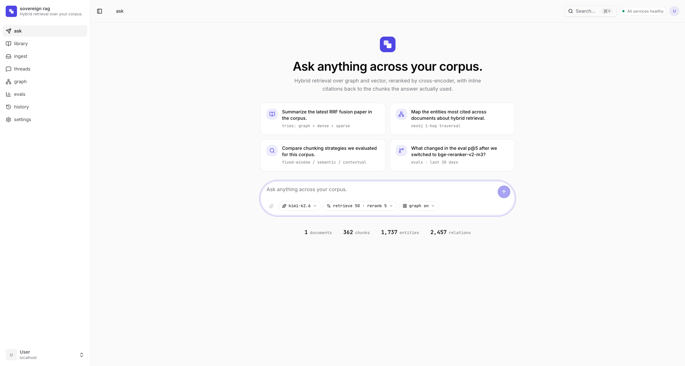
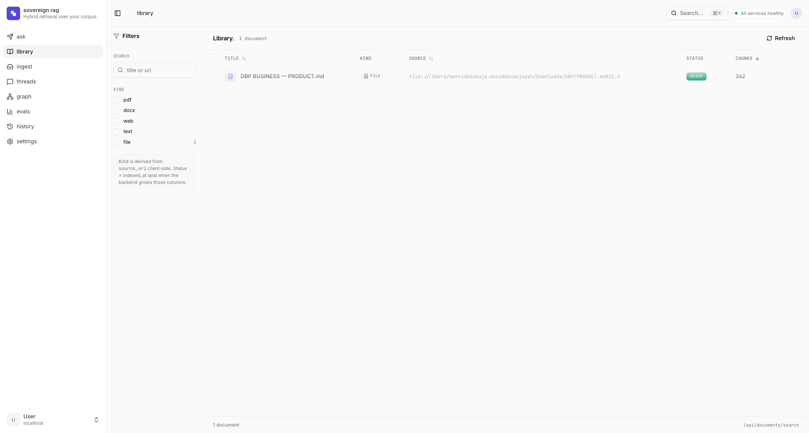
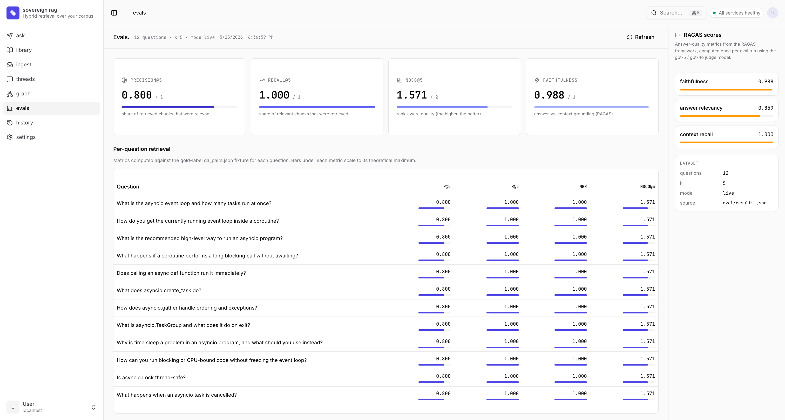
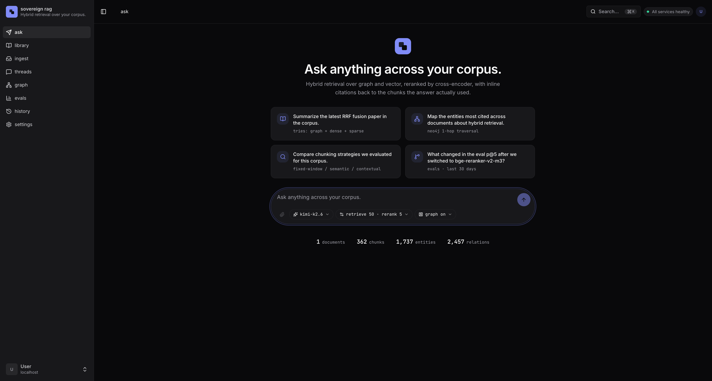
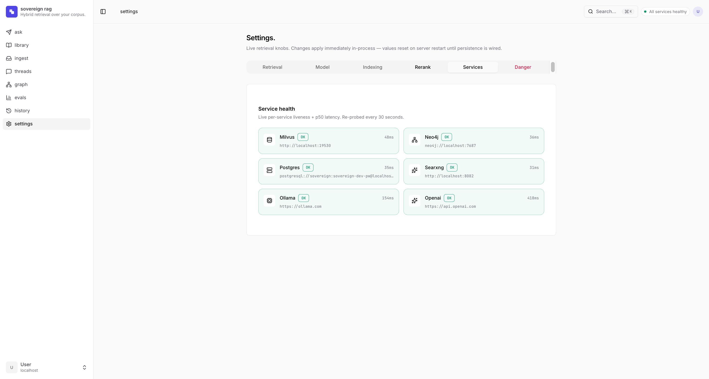

# sovereign-rag

> **Local-first GraphRAG** — not fully self-hosted: Milvus hybrid retrieval (dense + BM25) plus Neo4j knowledge-graph local-search, then cross-encoder reranking, with Anthropic-style contextual retrieval. Web ingestion via Docling / Crawl4AI / SearXNG.
> **Local development** runs end-to-end on **Ollama** with no paid APIs. **CI integration tier** uses Ollama Cloud + OpenAI embeddings (the Mac Mini runner can't host a local Ollama daemon, and Ollama Cloud has no embeddings endpoint). Details in [Two-tier CI](#two-tier-ci).

[](https://github.com/Mohar7/sovereign-rag/actions/workflows/ci.yml)
[](https://www.python.org/downloads/)
[](https://milvus.io/)
[](https://neo4j.com/)
[](https://ollama.com/)
[](LICENSE)

**Local-dev (default).** Everything runs on your own machine — the LLM (Ollama), the embeddings (Ollama `bge-m3`), the reranker (`Alibaba-NLP/gte-reranker-modernbert-base` cross-encoder, runs on MPS / CUDA / CPU), the vector DB (Milvus), the graph DB (Neo4j), and web search (SearXNG) are all local or self-hosted. No paid keys required. The defaults in `config.py` reflect this.

**Honest caveat.** The CI integration tier on a self-hosted Mac Mini runner swaps the LLM to **Ollama Cloud** and embeddings to **OpenAI** — the Mac Mini can't reasonably host a local Ollama daemon, and Ollama Cloud doesn't expose an embeddings endpoint. So "sovereign-rag" is the *architecture* and the *local-dev path*; the CI integration job is not. Details in [Two-tier CI](#two-tier-ci).

## Web UI

A modern web client for the whole retrieval workflow — ask questions with streamed, cited answers; inspect the hybrid pipeline per turn (graph + dense + sparse → RRF → cross-encoder rerank); browse the corpus; and explore the entity graph. Built in `frontend/` with **React 19 + TypeScript**, **shadcn/ui** (new-york) on **Tailwind v4**, **TanStack** Router/Query/Table/Form, **lucide** icons, and **sonner** toasts. Fully localized in **English and Russian** (i18next), with **light and dark** themes. It talks to the FastAPI backend over a typed `fetch` client, with SSE for token streaming.



|     |     |
|---|---|
|  |  |
|  |  |

The interface is a from-scratch design system in the register of **Linear · Vercel · Cal.com** — a single indigo accent over a zinc neutral ramp, restrained motion, and inline citation chips that open the exact source chunk the answer used. See [`frontend/README.md`](frontend/README.md) to run it locally (`npm run dev` proxies `/api` to the backend) or deploy it (`docker compose --profile ui up`).

## Why this exists

"Naive RAG" (embed -> cosine search -> stuff the prompt) loses to current best-practice on real corpora. This project implements the 2025/26 stack a senior reviewer expects, and **measures** each layer:

| Technique | What it buys | Here |
|---|---|---|
| **Hybrid search** (dense + BM25, RRF) | BM25 catches exact tokens (codes, names, IDs) dense embeddings miss | Native in Milvus 2.6 — one `hybrid_search` call, server-side BM25 |
| **Cross-encoder reranking** | Biggest quality-per-line jump; re-scores top-50 -> top-5 | `Alibaba-NLP/gte-reranker-modernbert-base` via sentence-transformers — multilingual (ModernBERT), ~149M params, Apache 2.0, MPS/CUDA/CPU, no API |
| **Contextual Retrieval** (Anthropic, 2024) | Prepends chunk-situating context before indexing; ~-35% retrieval failures | Local LLM generates the prefix |
| **GraphRAG local-search** | Multi-hop questions vector search can't answer | Neo4j entity graph: vector-seed -> 1-hop traverse |
| **Evaluation harness** | Proves the above instead of cargo-culting it | RAGAS (Ollama judge) + retrieval precision@k |
| **LangGraph orchestration** | Self-correcting CRAG loop (grade → rewrite → web search → HITL approval → crawl+index → re-retrieve), HITL approval on web fallback, persistent threads | `StateGraph` + conditional edges + `interrupt()` + `AsyncPostgresSaver` checkpointer |

## Architecture

**Control plane** — LangGraph QA graph (`src/sovereign_rag/graphs/rag_qa/`):

**Linear path** (default, `ENABLE_CORRECTIVE_RAG` unset or `false`):

```
START → retrieve_local → rerank → generate → END
```

**Self-correcting CRAG loop** (`ENABLE_CORRECTIVE_RAG=true`):

```
                              START
                                |
                                v
             ┌──────► retrieve_local   Milvus hybrid + Neo4j graph + dedup
             │                |
             │                v
             │            rerank       gte-reranker-modernbert-base (MPS/CUDA/CPU)
             │                |
             │                v
             │            grade        hybrid: score thresholds + light-tier LLM
             │                |
             │    ┌───────────┴────────────────┐
             │    │ Correct                    │ Ambiguous / Incorrect
             │    │ (or attempts exhausted)    │ (attempts < crag_max_corrections)
             │    v                            v
             │  generate     LLM        transform_query
             │    |          with [n]         |
             │    v          citations        v
             │   END                     web_search    SearXNG → candidate_urls
             │                                |
             │                                v
             │                        request_approval  interrupt() — HITL pause
             │                           /       \
             │              approved_urls        approved_urls=[]
             │              (non-empty)          (decline)
             │                  |                    |
             │                  v                    v
             │            crawl_index            generate (local only) → END
             │            Crawl4AI →
             │            index_document
             │            attempts++
             └────────────────┘
```

The CRAG loop is **default-OFF** — set `ENABLE_CORRECTIVE_RAG=true` to enable it. `enable_corrective_rag` is a build-time structural flag: changing it requires restarting the process (graph recompile). With it off, the original linear graph is built unchanged.

**Data plane** — Milvus + Neo4j + ingestion (the bits LangChain's wrappers don't expose: RRF hybrid, GraphRAG local-search, contextual prefixing):

```
  Ingestion ----------------------------------------------------------------+
   Docling (PDF/DOCX->md) . Crawl4AI (web->md) . SearXNG (search) . text     |
                                   |                                         |
                                   v                                         |
   chunk (recursive ~400tok/15%) -> contextualize (LLM prefix)               |
                                   |                                         |
                +------------------+-------------------+                     |
                v                                      v                     |
   +------------------------+           +---------------------------+        |
   | Milvus 2.6             |           | Neo4j 5 Community         |        |
   |  dense (HNSW/COSINE)   |           |  Chunk + Entity graph     |        |
   |  + sparse BM25 (native)|           |  native vector index      |        |
   |  hybrid_search + RRF   |           |  LLM entity extraction    |        |
   +------------------------+           +---------------------------+        |
                                                                              |
  Eval: RAGAS (faithfulness / context-precision) + precision@k                |
  Obs:  Langfuse (optional)                                                   |
  State: Postgres (LangGraph checkpoints, threads, interrupt resumes)         |
```

**Stack.** Python 3.12 · **LangGraph 1.x** (StateGraph, conditional edges, HITL, AsyncPostgresSaver) · LangChain 1.x (splitters/contracts) · **Milvus 2.6** (`pymilvus`, AsyncMilvusClient) · **Neo4j 5 Community** (`neo4j-graphrag`) · **Postgres 16** (LangGraph checkpoints) · **Ollama** (`langchain-ollama`; qwen2.5:7b + bge-m3) · **`Alibaba-NLP/gte-reranker-modernbert-base`** cross-encoder via sentence-transformers · **Docling** (IBM, layout-aware parsing) · **Crawl4AI** + **SearXNG** ingestion · **RAGAS** eval · FastAPI · uv · ruff/mypy/pytest.

## Quick start

```bash
# 1. Models — default: OpenAI (set OPENAI_API_KEY in your environment)
export OPENAI_API_KEY=sk-...   # chat = gpt-5.4 family, embeddings = text-embedding-3-large
# Fully-local fallback instead: set llm_provider=ollama / embed_provider=ollama, then:
#   ollama serve & ; ollama pull qwen2.5:7b ; ollama pull bge-m3

# 2. Infra (Milvus + Neo4j + Postgres + SearXNG)
cp .env.example .env          # set NEO4J_PASSWORD / POSTGRES_PASSWORD
docker compose up -d          # etcd+minio+milvus, neo4j, postgres, searxng

# 3. App
uv sync
uv run uvicorn sovereign_rag.api.main:app --reload
# http://localhost:8000/docs

# 4. (Optional) LangGraph dev server + Studio UI
uv run langgraph dev
# → http://127.0.0.1:2024 + Studio link in the terminal
```

> This is a heavy stack: Milvus standalone is 3 containers, Neo4j wants ~2 GB, and Docling/Crawl4AI pull torch + Chromium. Intended to run on a workstation or a sandbox VM, not a 1 GB box.

### Use it

```bash
# Index a PDF (Docling)
curl -F "file=@paper.pdf" http://localhost:8000/documents/file

# Index a web page (Crawl4AI)
curl -X POST http://localhost:8000/documents/url \
  -H 'Content-Type: application/json' -d '{"url":"https://example.com/article"}'

# Search the web (SearXNG) + ingest top hits
curl -X POST http://localhost:8000/ingest/search \
  -H 'Content-Type: application/json' -d '{"query":"milvus hybrid search","max_results":3}'

# Ask — hybrid + graph retrieval, reranked, cited.
# When ENABLE_CORRECTIVE_RAG=true: after rerank a grade step classifies local
# context quality. On a weak grade the graph rewrites the query, searches the
# web with SearXNG, then pauses (interrupt()) for human approval of which URLs
# to crawl. The client approves a subset via POST /ask/resume.
curl -X POST http://localhost:8000/ask \
  -H 'Content-Type: application/json' -d '{"question":"How does BM25 fusion work here?"}'
# -> {"thread_id":"...","status":"ok","answer":"...[1][2]...","citations":[...],"grade":{"label":"correct","confidence":0.87,"reason":"..."}}
# or (when CRAG fires and grades the context weak):
# -> {"thread_id":"...","status":"interrupted",
#     "interrupt":{"reason":"approve_urls","candidate_urls":[{"url":"...","title":"...","snippet":"..."}]},
#     "grade":{"label":"ambiguous","confidence":0.45,"reason":"..."}}

# Approve a subset of URLs (crawl + re-retrieve + answer):
curl -X POST http://localhost:8000/ask/resume \
  -H 'Content-Type: application/json' \
  -d '{"thread_id":"<above>","approved_urls":["https://example.com/article"]}'
# -> {"thread_id":"...","status":"ok","answer":"...","fallback_used":true,"citations":[...]}

# Decline (answer from local corpus only — approved_urls: []):
curl -X POST http://localhost:8000/ask/resume \
  -H 'Content-Type: application/json' \
  -d '{"thread_id":"<above>","approved_urls":[]}'

# SSE streaming variants (streams node progress + LLM tokens;
# emits grade/interrupt/crawl_progress events for the CRAG path):
curl -N -X POST http://localhost:8000/ask/stream \
  -H 'Content-Type: application/json' -d '{"question":"..."}'
# After an interrupt, resume with SSE:
curl -N -X POST http://localhost:8000/ask/resume/stream \
  -H 'Content-Type: application/json' \
  -d '{"thread_id":"<above>","approved_urls":["https://example.com/article"]}'
```

## How retrieval works

The QA path is a LangGraph `StateGraph` (`src/sovereign_rag/graphs/rag_qa/`).

### Linear path (default)

1. **`retrieve_local`** — Milvus `hybrid_search` (dense ANN + native BM25, fused with `RRFRanker`) and Neo4j `local_search` (vector-seed chunks → traverse `MENTIONS` edges 1 hop → append relation facts) run concurrently and get deduped by `chunk_id`.
2. **`rerank`** — `Alibaba-NLP/gte-reranker-modernbert-base` cross-encoder (sentence-transformers) re-scores the union and keeps top-`RERANK_TOP_K` on MPS / CUDA / CPU.
3. **`generate`** — the LLM answers using only the numbered passages, citing `[n]` inline; the API returns structured citations.

### Self-correcting CRAG loop (`ENABLE_CORRECTIVE_RAG=true`)

After step 2 (`rerank`), a **`grade`** step is inserted:

4. **`grade`** — hybrid grader classifies local context as **Correct / Ambiguous / Incorrect**. The top-1 reranker score is sigmoid-normalized to `[0,1]`; scores ≥ `crag_correct_threshold` (0.70) → Correct (skip LLM); scores ≤ `crag_incorrect_threshold` (0.30) → Incorrect; in-between → one light-tier LLM call decides. On **Correct** (or when `crag_max_corrections` attempts are exhausted), the graph routes to `generate`.

On a weak grade (Ambiguous or Incorrect, under the attempt budget):

5. **`transform_query`** — light-tier LLM rewrites the question into a focused web search query.
6. **`web_search`** — SearXNG returns up to `web_fallback_max_urls` (5) candidate URLs; the graph pauses via `interrupt()`.
7. **`request_approval` (HITL)** — the API returns `{"status":"interrupted","interrupt":{"reason":"approve_urls","candidate_urls":[...]}}`. The client resumes with `POST /ask/resume {"thread_id":"...","approved_urls":[...]}`. Passing `[]` = **decline** (answer from local corpus only). Passing URLs = **approve** (crawl + index + loop back to `retrieve_local`).
8. **`crawl_index`** — each approved URL is crawled via Crawl4AI and indexed via `RAGPipeline.index_document`. `correction_attempts` is incremented; the loop returns to step 1 where `retrieve_local` now sees the newly-indexed web chunks.

Each thread is checkpointed in Postgres (`AsyncPostgresSaver`), so interrupted runs survive restarts and can be resumed from a different request. Every layer is toggle-able via env (`ENABLE_GRAPH_RETRIEVAL`, `ENABLE_CONTEXTUAL_RETRIEVAL`, `ENABLE_CORRECTIVE_RAG`) so the eval harness can A/B their contribution.

### LangGraph dev / Studio

```bash
uv run langgraph dev   # serves the graph on http://127.0.0.1:2024
# Open the Studio link the CLI prints to inspect state, replay, and
# step through interrupts interactively.
```

`langgraph.json` declares two graphs: `rag_qa` (`graphs/rag_qa/graph.py:make_graph`) and `indexer` (`graphs/indexer/graph.py:make_graph`). The CLI attaches its own in-memory checkpointer, so you don't need Postgres for dev-server play. FastAPI in production uses the Postgres-backed checkpointer.

### Corrective RAG config knobs

All CRAG settings live in `config.py` and are overridable via env:

| Setting | Default | Purpose |
|---|---|---|
| `ENABLE_CORRECTIVE_RAG` | `false` | Master toggle. Off → linear graph. On → CRAG self-correcting loop. Requires process restart (build-time structural flag). |
| `CRAG_CORRECT_THRESHOLD` | `0.70` | Sigmoid-normalized top-1 reranker score ≥ this → Correct (no LLM call). |
| `CRAG_INCORRECT_THRESHOLD` | `0.30` | Score ≤ this → Incorrect (no LLM call); between the two thresholds → light-tier LLM grader. |
| `CRAG_MAX_CORRECTIONS` | `1` | Corrective rounds before forcing `generate` with what the graph has. |
| `CRAG_GRADER_TIER` | `"light"` | LLM tier (`default` / `light` / `nano`) for the middle-band grader call. |
| `WEB_FALLBACK_MAX_URLS` | `5` | Candidate URLs surfaced to the human for approval per correction. |
| `WEB_FALLBACK_CRAWL_TOP_K` | `3` | URLs the eval auto-approver picks (graph-driven eval mode); not used on the product path. |

### Web UI CRAG surfaces

When CRAG is enabled, the web UI gains:
- **HITL approval card** — inline in the Ask conversation: a grade chip + URL checklist (with optional "unverified" badge) + co-equal "Crawl & continue" / "Decline" buttons; live per-URL `crawl_progress` status during crawling.
- **Grade chip** — appears on the answer meta line (happy path) and in the approval card header.
- **"Corrected via web" provenance badge** — on the answer meta line + `web` kind icon on crawled-this-turn citations.
- **Agentic pipeline strip** — shows the three-lane corrective pass (local corpus → correction → re-retrieve) with `grade`, `transform_query`, `web_search`, `crawl_index` stages.
- **Settings → "Corrective RAG" section** — enable switch, grade-band dual-handle slider, max corrections stepper, max URLs slider.
- **Run History** — grade chip, fallback indicator, approve/decline decision badge, "used web fallback" filter.
- **Evals → "Corrective RAG impact" panel** — A/B precision/recall delta cards, fallback-fired rate, grade-distribution bar.
- **Threads "needs approval" badge** — amber-ringed thread card for paused interrupts.

## Evaluation

```bash
uv run python eval/evaluate.py
```

Loads `eval/qa_pairs.json` (a golden set over a self-contained corpus in `eval/corpus/`), runs retrieval for each question, and reports **retrieval precision@k / recall@k / MRR / NDCG** plus **RAGAS** (faithfulness, answer relevancy, context precision/recall) — with the **Ollama** model as judge, no OpenAI. Without services running it degrades to an offline IR demo over the bundled corpus and says so.

## Project layout

```
src/sovereign_rag/
  documents.py        # SourceDocument / Chunk / RetrievedChunk contracts
  config.py           # pydantic-settings, local-by-default (incl. CRAG knobs)
  providers/
    ollama.py         # ChatOllama + OllamaEmbeddings
    reranker.py       # gte-reranker-modernbert-base via sentence-transformers (MPS/CUDA/CPU)
  chunking.py         # recursive split + contextual-retrieval prefixing
  ingestion/          # docling (pdf) . crawl4ai (web) . searxng (search)
  vectorstore/
    milvus_store.py   # dense + native BM25 hybrid, RRF
  graph/
    neo4j_store.py    # LLM entity extraction + vector-seed graph traverse
  retrieval/
    pipeline.py       # RAGPipeline (index_document path + shared helpers)
    grading.py        # hybrid grader: Grade dataclass + grade_candidates()
  graphs/
    rag_qa/           # LangGraph QA graph (linear or CRAG loop)
      state.py        # RAGState TypedDict (incl. CRAG fields)
      nodes.py        # retrieve_local / rerank / grade / transform_query /
                      #   web_search / request_approval (interrupt) / crawl_index / generate
      graph.py        # StateGraph build + compile-with-checkpointer
    indexer/          # LangGraph indexer graph
  api/
    main.py           # FastAPI app + lifespan
    ask/
      router.py       # /ask · /ask/stream · /ask/resume · /ask/resume/stream
      schemas.py      # AskRequest/Response, InterruptModel, ResumeRequest, GradeModel
    runs/ · threads/ · settings/ · …
langgraph.json        # exposes rag_qa + indexer graphs for langgraph dev / Studio
eval/                 # golden set + RAGAS + IR metrics
tests/                # unit tests (services mocked); integration marked + skipped
```

## Testing

```bash
uv run pytest -m "not integration"   # 122 unit tests, no services, ~5s
uv run ruff check src/ tests/ eval/
uv run mypy src/
```

Tests that need Milvus/Neo4j/Ollama are marked `@pytest.mark.integration` and skipped unless the services are reachable (gated by `RUN_*_IT=1` env flags) — so CI and contributors run the full unit suite offline. Live/integration runs belong on a machine with the full stack up, not on a dev laptop or a GitHub-hosted runner.

### Two-tier CI

| Workflow | Runner | What runs |
|---|---|---|
| `ci.yml` | GitHub-hosted `ubuntu-latest` | ruff + mypy + unit tests (no services) — fast, on every push/PR |
| `integration.yml` | **self-hosted** `[self-hosted, macOS, sovereign]` | brings up the compose stack (Milvus + Neo4j + SearXNG), runs `pytest -m integration` + the live eval harness — on push-to-main / manual dispatch only |

The integration tier needs Docker + browser deps + LLM + embeddings. The Mac Mini runner can't reasonably host a local Ollama daemon, and **Ollama Cloud does not expose an embeddings endpoint** — so the CI tier uses:

- **LLM**: Ollama Cloud `kimi-k2.6` (`OLLAMA_API_KEY` secret)
- **Embeddings**: OpenAI `text-embedding-3-large` at 3072-dim (`OPENAI_API_KEY` secret) — `EMBED_PROVIDER=openai` flips the dispatcher
- **Vector store / graph / search**: local containers on the runner (compose stack)

This is the only place the project depends on paid APIs, and it's documented honestly. The defaults in `config.py` and the local-dev path stay 100% local. Per-run cost on the golden set is in cents.

Register the runner with:

```bash
# on the Mac Mini, from the repo's Settings -> Actions -> Runners -> New
./config.sh --url https://github.com/Mohar7/sovereign-rag --token <TOKEN> \
            --labels self-hosted,macOS,sovereign
./svc.sh install && ./svc.sh start    # run as a background service
```

Repo secrets required for the integration job: `OLLAMA_API_KEY`, `OPENAI_API_KEY`.

**Security:** `integration.yml` triggers only on `push` to `main` and `workflow_dispatch` — never on pull requests. A self-hosted runner must not execute untrusted fork code. Keep "Require approval for all outside collaborators" enabled in repo Settings.

## Roadmap

- [ ] **Semantic chunking** — replace fixed recursive splitting with embedding-similarity breakpoint chunking; A/B against recursive in the eval harness.
- [ ] **Camoufox** ingestion tier for anti-bot sites (lazy-imported hook already in `ingestion/web.py`).
- [ ] Community-detection global-search (Leiden) on the graph for "dataset-wide" questions.
- [ ] Parent-document retrieval (small-to-large) on the Milvus side.

## License

MIT — see [LICENSE](LICENSE).
