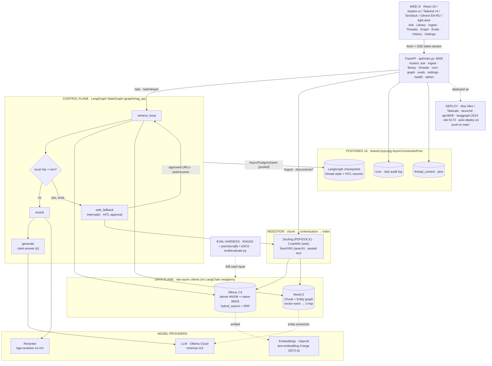

# sovereign-rag — Architecture

A local-first GraphRAG system: a **LangGraph control plane** orchestrates a
**hybrid data plane** (Milvus dense+BM25 with RRF fusion ‖ Neo4j knowledge-graph
local-search), cross-encoder reranking, and an LLM that answers with inline
citations — with human-in-the-loop (HITL) on web fallback and Postgres-backed
thread persistence.

> GitHub renders the Mermaid below inline. A rendered image is also at
> [`architecture.png`](architecture.png) / [`architecture.svg`](architecture.svg).

## Layers

| Layer | What it is |
|---|---|
| **Web UI** | React 19 + shadcn/ui (Tailwind v4) + TanStack Router/Query/Table/Form + i18next (EN/RU), light/dark. Talks to FastAPI over `fetch`, with SSE for streamed answers. |
| **API** | FastAPI (`api/main.py`, :8000) with domain routers. A lifespan opens the Postgres pool + the compiled graph. |
| **Control plane** | LangGraph `StateGraph` (`graphs/rag_qa`): `retrieve_local` → conditional `web_fallback` (HITL `interrupt()`) → `rerank` → `generate`. Checkpointed in Postgres via a **pooled** `AsyncPostgresSaver`, so threads + interrupts survive restarts. |
| **Data plane** | Raw async clients (not LangChain wrappers): **Milvus 2.6** dense HNSW + native BM25, fused with RRF; **Neo4j 5** chunk+entity graph, vector-seed then 1-hop traverse. |
| **Ingestion** | Docling (PDF/DOCX) · Crawl4AI (web) · SearXNG (search) · text → recursive chunk → contextual prefix → index into both stores. |
| **Providers** | LLM: Ollama Cloud `minimax-m3`. Embeddings: OpenAI `text-embedding-3-large` (3072-d). Reranker: `BAAI/bge-reranker-v2-m3` cross-encoder (MPS/CUDA/CPU). |
| **Persistence** | Postgres 16 (one shared psycopg pool): LangGraph checkpoints, the `runs` audit log, and `thread_context` pins/exclusions. |
| **Eval & deploy** | RAGAS + precision@k/nDCG harness (`eval/`); deployed on a Mac Mini (Tailscale) as launchd services, auto-deployed on push to `main`. |
